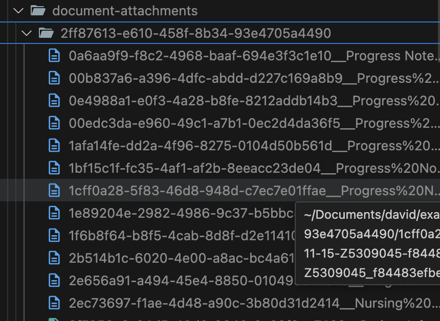
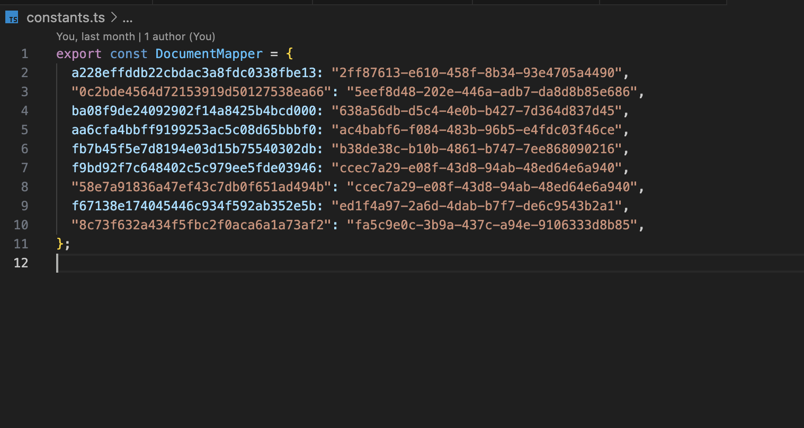
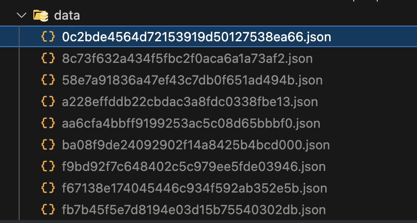
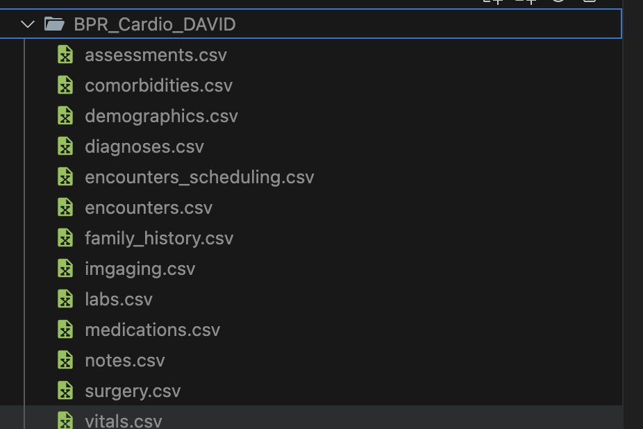
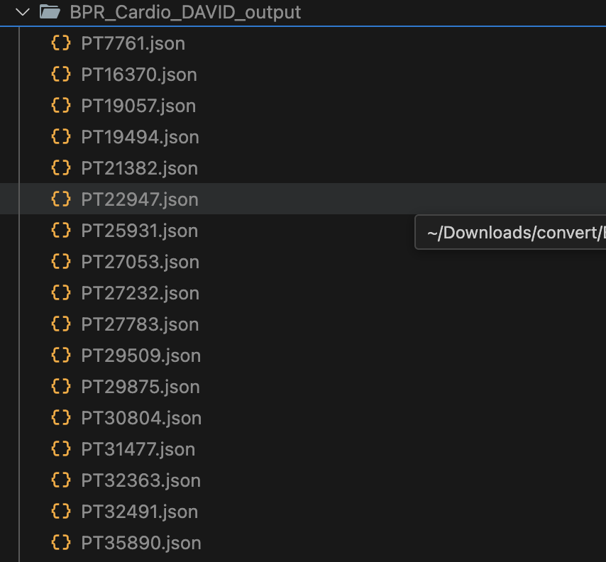

Once the data files are properly set up, running below command will create FHIR bundles in output folder.

```
npm run start
```


document-attachments - will hold document attached, 
Folder name inside document-attachments is unique ids map to file ids from bpr data (look at constants.ts)






make sure data folder contains, appropriate JSONs in valid format with corresponding ids from bpr data (Values in the mapper)



#### Pulling data from csvs.

- Place all the csv files in folder BPR_cardio_DAVID
- Make sure all the csv files mrn column and linking data to patient.
- rename the files as below.



- run node bpr.convert
  
- you will find appropriate grouped data created in BPR_Cardio_DAVID_output like below
  


- Now in order to create FHIR bundles for above grouped data, move the necessary/all files to data folder and run the npm run start command. 
